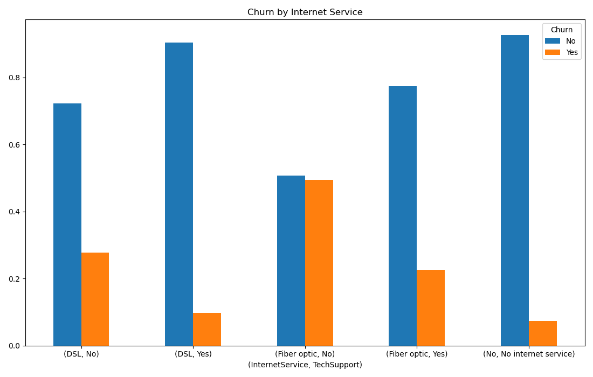
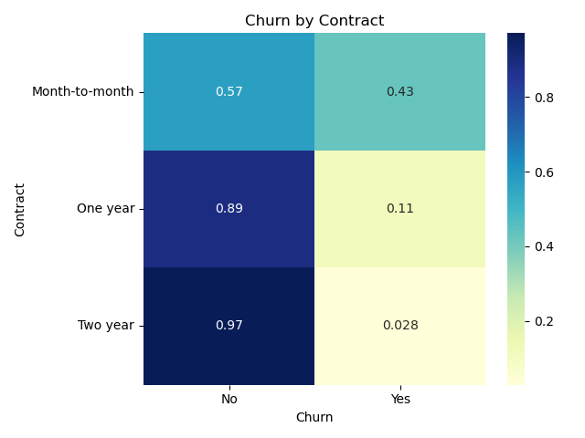

# 📊 Customer Churn Analysis & Prediction – Telco Dataset

## 🧠 Overview

This project analyzes customer churn behavior in a telecommunications company and builds a predictive model to identify high-risk customers. The objective is to combine exploratory data analysis with machine learning to generate actionable business insights and support retention strategies, and present a business dashboard using Tableau.

---

## 📁 Dataset

* Source: Telco Customer Churn Dataset
* ~7,000 customer records
* Includes:

  * Demographics
  * Account details (contract, tenure, billing)
  * Services (internet, tech support, etc.)
  * Churn status

---

## 🎯 Objectives

* Identify key drivers of customer churn
* Detect high-risk customer segments
* Estimate revenue exposure
* Build a predictive model for churn classification

---

## 🔍 Key Insights

* Month-to-month contracts have the highest churn (~43%)
* Fiber optic customers without Tech Support show ~50% churn
* ~2,200 high-value customers represent ~$200K/month at risk
* Churn is concentrated in early-stage (low tenure) customers

---

## 🤖 Predictive Modeling

A Random Forest Classifier was trained to predict churn probability using key behavioral and service-related features.

**Model Performance:**

* AUC Score: **0.8576**
* Confusion Matrix:

  * True Negatives: 1141
  * False Positives: 398
  * False Negatives: 100
  * True Positives: 474

**Business Impact:**

* Identified **474 high-risk customers**
* Represents approximately **$35K/month in recoverable revenue**

---

## 📊 Data Visualization

### Internet Service Analysis

### Contract Type Analysis

---

## 📈 Tools & Technologies

* Python (Pandas, Matplotlib, Seaborn)
* Scikit-learn (Random Forest, Model Evaluation)
* Data Analysis & Feature Engineering
* Tableau (Dashboard Visualization)

---

## 🔗 Interactive Dashboard

Explore the full dashboard on Tableau:

👉 [View Full Tableau Dashboard]((https://public.tableau.com/views/Telco_Churn_17776656598520/Dash?:language=pt-BR&:sid=&:redirect=auth&:display_count=n&:origin=viz_share_link))

---

## 💡 Business Recommendations

* Promote long-term contracts to reduce churn
* Bundle Tech Support with Fiber plans
* Focus retention efforts on early-tenure customers
* Use predictive model to target high-risk clients proactively

---
- Breno Larocerie Zamponi
---
